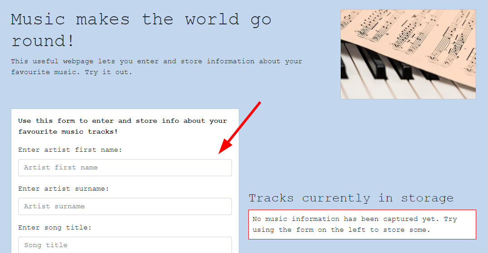
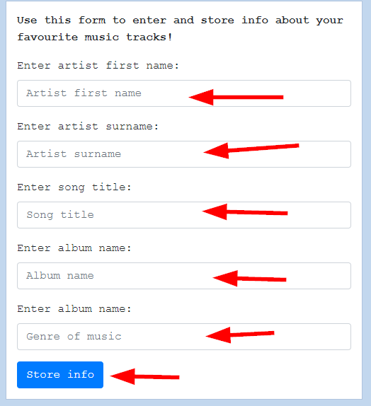
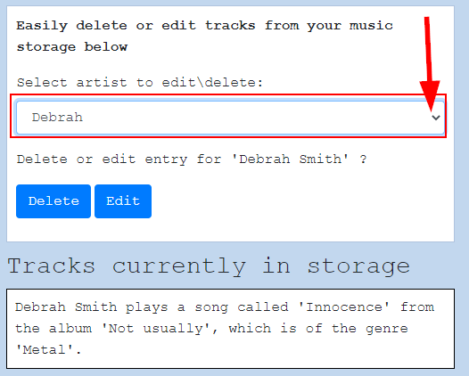
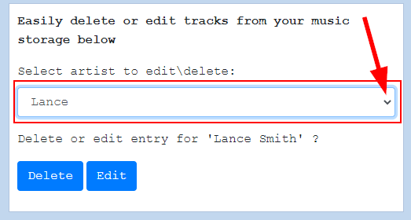

# HyperionDev Full Stack Web Development Bootcamp - Level 1 - Task 13 - JSON - Music storage

## Description

This task was about using the web storage API and JSON to create a small website. The website allows you to store, edit or delete music tracks.

**JSON, or JavaScript Object Notation**, is a syntax for converting objects, arrays, numbers, strings, booleans into a format that can be transferred between the web server and the client. Like XML, JSON is language independent.

The **Web Storage API** stores data using key value pairs. This mechanism of storing data has to a large extent replaced the use of cookies for storing data about the current user's interaction with the website.

The Web Storage API allows us to store state information in two ways:

1. sessionStorage stores state information for each given origin for as long as the browser is open.
2. localStorage stores state information for each given origin even when the browser is closed and reopened.

You can see the website online at [https://evanmalherbe.github.io/music/](https://evanmalherbe.github.io/music/).

## Table of Contents

- [Instructions](#instructions)
- [Technologies](#technologies)
- [Installation](#installation)
- [Usage](#usage)
- [Credits](#credits)

## Instructions

These were the instructions I was given to guide me:

Follow these steps:

- Create a webpage that can be used to let a user store information about a catalogue of music.
  - The user should be able to add information (e.g. artist, title, album, genre etc) about their favourite tracks.
  - All the information about all the tracks added by the user should be listed on the webpage.
  - The user should also be able to remove or edit information for a track.

### Technologies

This project uses:

- HTML 5
- CSS 3
- Javascript ECMAScript 2021
- JSON and Web Storage API

## Installation

This project was created using HTML, CSS and Javascript, so it needs no special installation. Simply open the index.html file in your browser and enjoy.

## Usage

1. Try out this music storage website by filling in the details of your favourite music tracks. See figure 1 below.

Figure 1

2. Once you have filled the info in to the boxes, click on the "Store Info" button to save your track. See figure 2 below.

Figure 2

3. You will see that your track info has been stored and is being displayed on the right side of the page. See figure 3 below.

Figure 3

4. If you want to edit a track that you have stored, click on the dropdown menu above where the tracks are displayed and choose the name of the track you want to edit. See figure 4 below.

Figure 4

5. Then click on the "Edit" button. See figure 5 below.

Figure 5

6. You will now see that you can edit/replace any of the information you had previously saved for this specific track. Fill in the info you wish to change, if any, and then click on the "Update" button when you are satisfied. See figure 6 below.

Figure 6

7. If you want to delete a track that you have saved, click on the dropdown menu as before and choose the name of the artist. See figure 7 below.

Figure 7

8. Then click on the "Delete" button to delete the track. You will see a small popup window that lets you know that the track has been delete successfully. See figure 8 below.

Figure 8

## Credits

This project was created by Evan Malherbe as part of a task for HyperionDev Full Stack Development Bootcamp November 2021 [GitHub profile](https://github.com/evanmalherbe)
